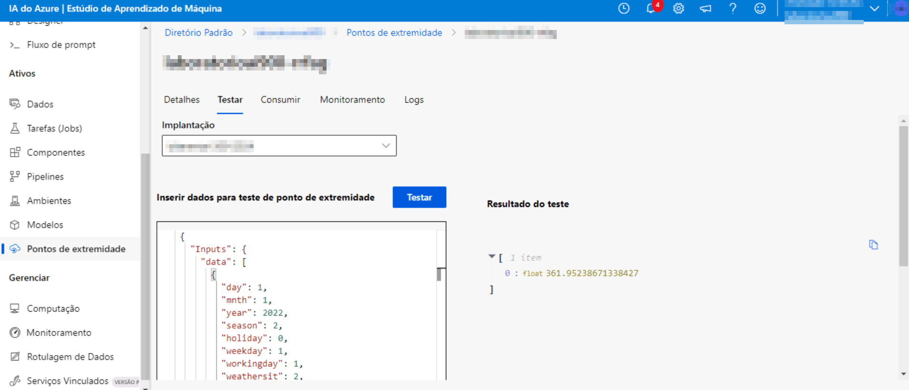

<h1>
    <a href="https://www.dio.me/">
     </a>    <span> Trabalhando com Machine Learning</span>
</h1>

## Criando modelo de previsão - Passo a passo

Para trabalhar com machine learning, é essencial que você possua um workspace. Esta é a tarefa inicial: criar o seu workspace para poder automatizar seu trabalho.

Depois que nosso workspace estiver pronto, devemos entrar no ML studio para criar um "novo trabalho de ML automatizado", seguindo o passo a passo da documentação do Learning para melhor entendimento e para que tudo dê certo:


### Vamos criar um aprendizado de máquina para a previsão de aluguel de bicicletas:


O tipo de tarefa é regressão e o nome de ativo de dados é aluguel de bicicletas, com fonte de dados da web.


A documentação do Learning é bem didática e traz todos os valores e configurações para que o trabalho automatizado seja criado:


Chegando na opção "examinar", basta enviar o seu trabalho de treinamento:


Após enviar, seu trabalho irá passar pelo processo de configuração das execuções e, após 15, podendo o tempo ser menor, estará concluído:


Pipeline com as etapas do processo de aprendizado e os testes realizados


## Teste do modelo

Na página do modelo, cliquei na aba "Pontos de extremidade". Também é possível acessar pelo menu lateral em "Pontos de extremidade". Cliquei no ponto correspondente ao modelo gerado. Em seguida, acessei a aba "Testar".

Para o teste, utilizei o json abaixo:

```json
{
  "input_data": {
    "data": [
       {
         "day": 1,
         "mnth": 1,   
         "year": 2022,
         "season": 2,
         "holiday": 0,
         "weekday": 1,
         "workingday": 1,
         "weathersit": 2, 
         "temp": 0.3, 
         "atemp": 0.3,
         "hum": 0.3,
         "windspeed": 0.3 
       }
     ]
  }
}
```

A previsão gerada foi: 361.95

