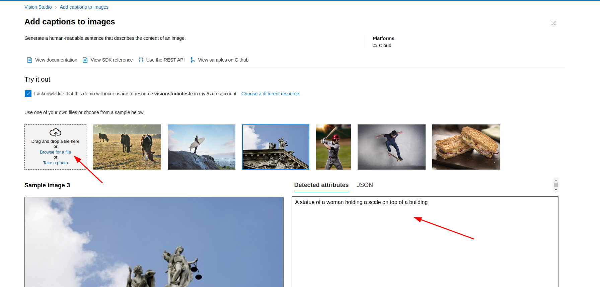

<h1>
    
     Reconhecimento Facial e transformação de imagens em Dados
</h1>

## Detect faces in an image
Por meio deste recurso, a Inteligência Artificial reconhece o rosto humano na imagem.

01 - No Vision Studio, na guia *Face*, clique em Detect faces in an image:

02 - O recurso apresenta algumas imagens de exemplo para que você realize testes do serviço e até mesmo a possibilidade de realizar upload de uma foto sua e obter a descrição:

## Add captions to imagens
Por meio deste recurso, a Inteligência Artificial descreve o que esta presente na imagem, possibilitando assim que deficientes visuais saibam o que esta presente na foto ou video.

01 - No Vision Studio, na guia *Add captions to imagens*, clique em Add captions to imagens:

02 - O recurso apresenta algumas imagens de exemplo para que você realize testes do serviço e até mesmo a possibilidade de realizar upload de uma foto sua e obter a descrição:

## Optical character recognition
Por meio deste recurso, a Inteligência Artificial extrai o texto que conseguir identificar na imagem, extremamente util para o escaneamento de documentos e notas:

01 - No Vision Studio, na guia *Optical character recognition*, clique em Optical character recognition:

02 - O recurso apresenta algumas imagens de exemplo para que você realize testes do serviço e até mesmo a possibilidade de realizar upload de uma imagem; logo após o upload, todo o texto contido na imagem aparece à direita:

## Considerações Finais

 Os recursos trazem inúmeras soluções para o dia a dia. O recurso de detecção e descrição da imagem enriquece ainda mais sistemas de segurança, os quais identificarão os rostos de quem passar à frente das câmeras, assim como reconhecerão rostos já conhecidos. O recurso de extração de texto ajudará inúmeras empresas a gerenciar seus arquivos antigos, assim como escanear e guardar dados de notas, facilitando assim a manutenção dos arquivos e o acesso aos mesmos.
