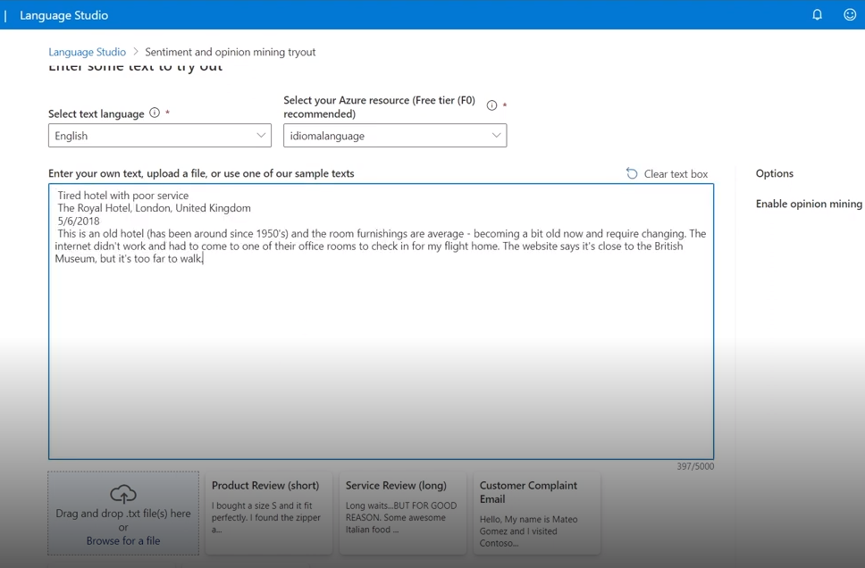

<h1>
    
     
Conversão de fala em texto com Speech Studio e Análise de Sentimentos com Language Studio 
</h1>

## Conversão de fala em texto
Com este recurso é possível transcrever com rapidez e precisão em mais de 100 idiomas e dialetos. Aumente a precisão de suas transcrições criando um modelo de fala personalizado que pode lidar com a terminologia específica de um domínio, ruído de fundo e sotaques.

### 01 - Dentro do Speech Studio crie um recurso de fala, clique na opção Conversão de fala em texto em tempo real e siga os passos abaixo:

## Analyze sentiment and mine opinions
Com este recurso a Inteligência Artificial analiza textos afim de descobrir o sentimento e satisfação do usuário que o escreveu, assim como as principais opiniões.

### 01 - Dentro do Language Studio guia *Classify test* clique na opção Analyze sentiment and mine opinions:

## Considerações Finais  

A integração das ferramentas de Conversão de Fala em Texto e Análise de Sentimentos representa um avanço significativo para as empresas no entendimento da satisfação do cliente e na interpretação das opiniões sobre seus produtos e serviços. Essas tecnologias possibilitam uma rápida transcrição de fala em vários idiomas e dialetos, bem como a criação de modelos personalizados para adaptação a diferentes contextos linguísticos.

Além disso, a capacidade de analisar sentimentos e extrair opiniões dos textos fornece insights valiosos para as organizações, permitindo uma resposta ágil às necessidades e preferências dos consumidores. Com isso, as empresas podem tomar decisões estratégicas com base em dados concretos, visando aprimorar continuamente a experiência do cliente e otimizar seus produtos e serviços para atender às demandas do mercado de forma mais eficaz.
