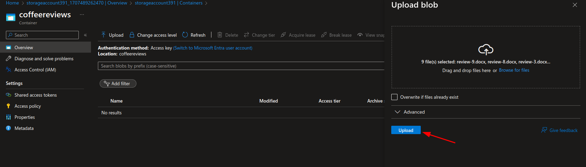
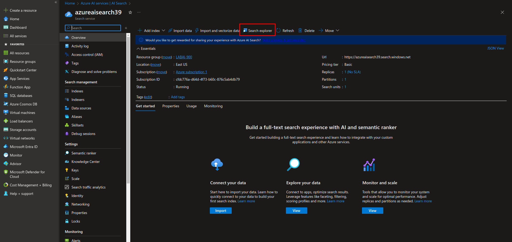

<h1>
    <a href="https://www.dio.me/">
     </a>
    <span> 
Azure Cognitive Search: Utilizando AI Search para indexação e consulta de Dados</span>
</h1>

## Problema:

O desafio propõe a criação de uma pesquisa que opere em conjunto com um serviço de inteligência artificial para identificar palavras-chave, analisar sentimentos e aproveitar o serviço de armazenamento do Azure.

[Documentação](https://microsoftlearning.github.io/mslearn-ai-fundamentals/Instructions/Labs/11-ai-search.html)

## Passo 1: Criando recurso do Azure AI Search:


## Passo 2: Criando recurso do Azure AI services:


## Passo 3: Criando o storage:


## Passo 4: Permitindo acesso anônimo ao Blob:

Dado que nosso laboratório é estritamente educacional, com o intuito de compreender os fundamentos da inteligência artificial com o Azure, é necessário habilitar o acesso anônimo ao blob para simplificar e agilizar nossas implementações. Após criar o seu armazenamento, acesse o mesmo e siga até a guia SETTINGS > CONFIGURATION conforme os passos abaixo:Dado que nosso laboratório é estritamente educacional, com o intuito de compreender os fundamentos da inteligência artificial com o Azure, é necessário habilitar o acesso anônimo ao blob para simplificar e agilizar nossas implementações. Após criar o seu armazenamento, acesse o mesmo e siga até a guia SETTINGS > CONFIGURATION conforme os passos abaixo:


## Passo 5: Criando o Container:

Dirija-se à aba DATA STORAGE > CONTAINERS para estabelecer o contêiner dentro do armazenamento e incluir as pesquisas que serão analisadas pelo serviço de IA.





## Passo 6: Importação e indexação dados para o AI SEARCH:      

Neste estágio, é necessário vincular / importar os dados que foram inseridos e configurados no seu armazenamento. Em seguida, retorne para o AI SEARCH e prossiga com os passos a seguir:


Esta etapa é crucial em todo o processo, como destacado no bootcamp. São muitos passos que precisam ser seguidos meticulosamente. É importante observar que podem haver algumas diferenças entre a documentação oficial e o que você encontrou ao configurar o seu sistema.

Ao seguir a [Documentação](https://microsoftlearning.github.io/mslearn-ai-fundamentals/Instructions/Labs/11-ai-search.html) você chegará em INDEX DOCUMETS, o qual o gif acima mostra o início do processo, siga os topicos até chegar na sessão 4:


**4. In the Attach Cognitive Services section, select your Azure AI services resource.**

Observe que as instruções pedem que você selecione o recurso AI SERVICE configurado. No entanto, pode ser que você não veja nenhum recurso disponível, apenas uma informação indicando que o acesso é gratuito e as configurações são limitadas. Não se preocupe com isso e prossiga para o Passo 5 . In the Add enrichments section.

Continue seguindo todas as configurações conforme indicado, concluindo no Passo 17. Select the indexer name to see more details.

## Passo 7: Consultando o índice:      

Após realizar todas as configurações, retorne ao AZURE AI SERVICES e acesse o nosso serviço. Utilize o SEARCH EXPLORER para testar se todos os dados foram indexados corretamente e se as consultas estão funcionando conforme o esperado, utilizando os comandos adequados.



```
search=*&$count=true    (  verifica se a indexação esta funcionando e mostra os documentos )
```


```
search=locations:'Chicago' ( Consulta as ocorrências acontecidas em Chicado )
```


## Observações finais:      

As ferramentas de inteligência artificial do Azure simplificam a consulta em documentos, pesquisas e depoimentos, tornando mais eficiente a análise da satisfação das empresas em relação aos seus produtos e serviços.


