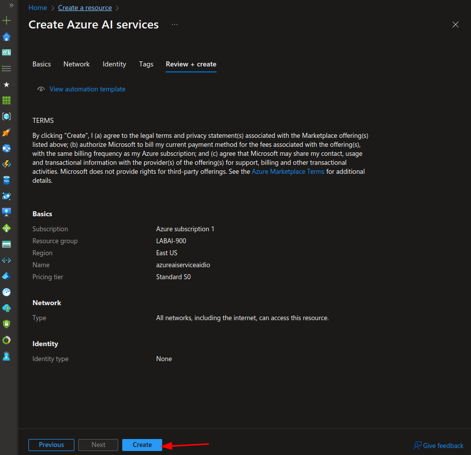
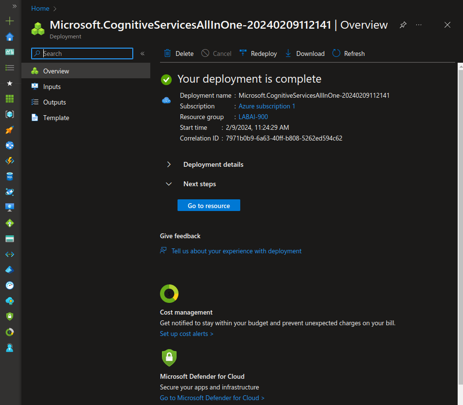
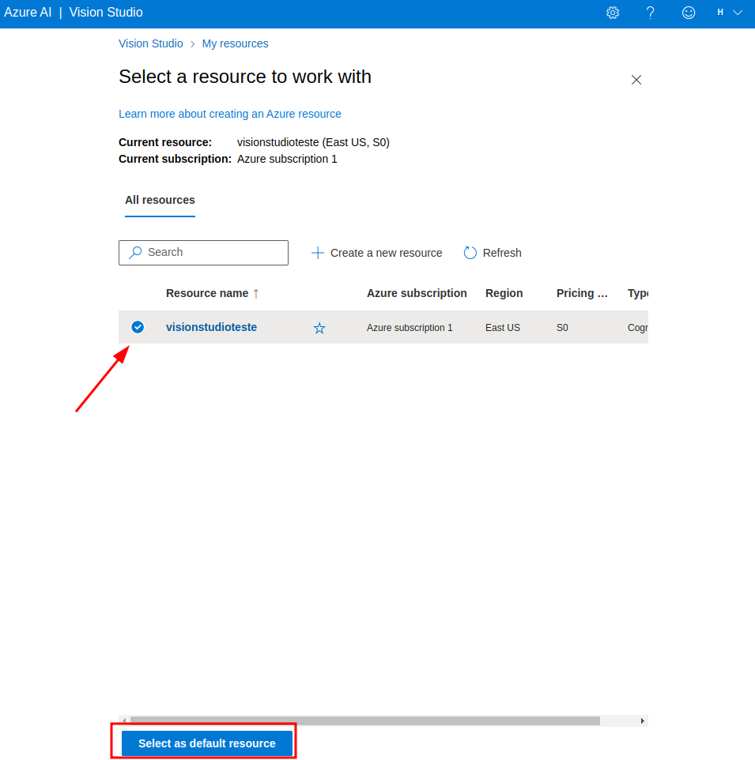
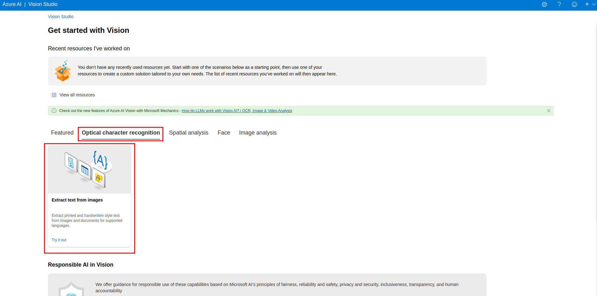
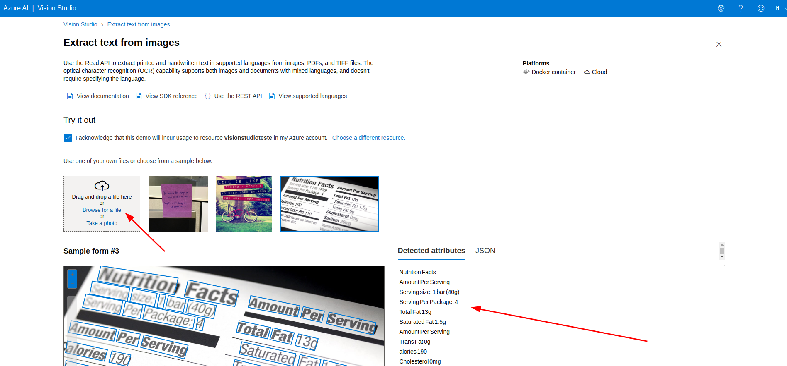

# Explorando os Recursos de IA Generativa

## Situação Problema

1. Crie uma pasta chamada 'inputs' e armazene as imagens que serão utilizadas.
2. Crie uma pasta chamada 'outputs' e armazene os resultados do reconhecimento de texto nessas imagens.

### Utilizaremos os recursos de reconhecimento de imagens do Azure AI Vision Studio.

## Passo 1: Criando recurso do Azure AI Services

Pesquise por Azure AI Services no marketplace e crie o recurso de inteligência artificial.

## Passo 2: Abrindo e configurando o Portal AI Vision Studio

Abra o Azure AI Vision Studio e selecione o serviço de inteligência artificial criado anteriormente.

## Passo 3: Utilizando as imagens no Azure AI Vision Studio

Na guia *Optical Character Recognition*, selecione a opção *Extract Text from Images*.

## Considerações finais

O recurso de reconhecimento e extração de textos em imagens do Azure facilita o reconhecimento e arquivamento de documentos, podendo ser empregado em notas fiscais e outros documentos.
